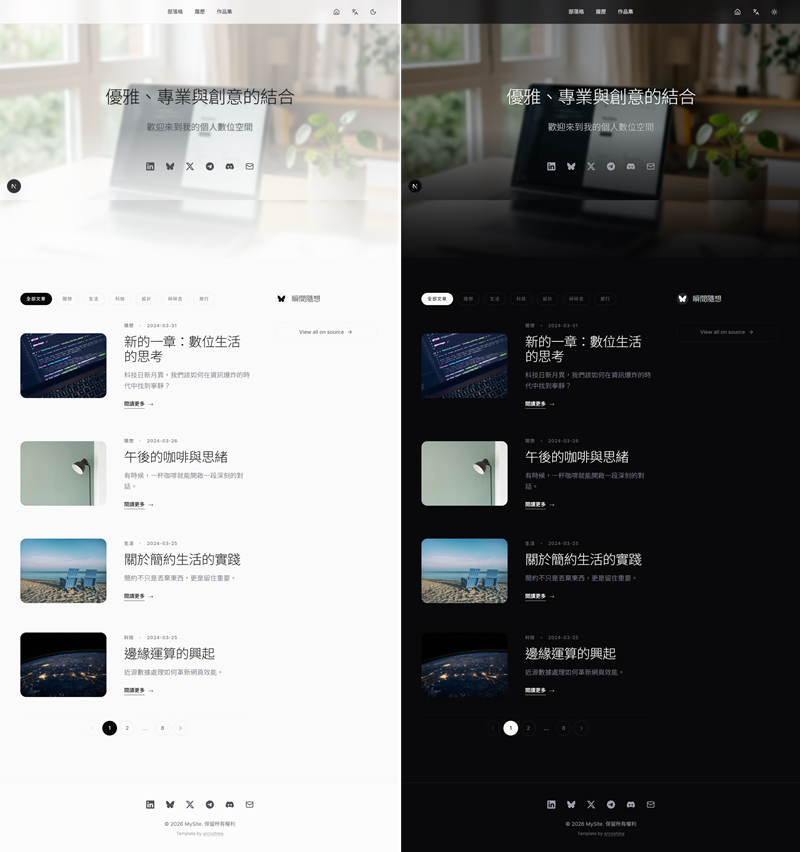

# Personal Website Template

[Live Demo 演示：https://personal-website-template-sooty.vercel.app/](https://personal-website-template-sooty.vercel.app/)

這是一個用 Markdown 管理文字內容的優雅風格個人網站模板，內建深色/淺色模式、雙語言支援。透過 github 可以輕易地更新網站內容，也可以直接讀取 Bluesky 的貼文。

首頁的按鈕可以在 `src/components/SocialLinks.tsx` 中修改。如果要引用外部圖片（例如類似 Unsplash 的圖床），需要在 `next.config.ts` 中手動加入信任網域。詳情請見下文。

## ✨ 核心功能 (Features)

- **優雅的視覺設計**：支援深色/淺色模式切換，並帶有絕美的玻璃擬物 (Glassmorphism) 特效。
- **進階作品篩選系統**：支持多選（Union）標籤篩選，讓訪客能同時探索不同領域的作品集。
- **持久化導航體驗**：在作品詳情頁加入持久化子導航欄，並能自動記憶返回時的篩選與分頁狀態。
- **基於 Markdown 的內容管理**：無須資料庫，只要編輯 `content/` 資料夾內的 `.md` 檔案，即可輕鬆更新履歷、部落格與作品集。
- **多語系支援 (i18n)**：內建英文 (`en`) 與繁體中文 (`tw`) 雙語系，架構容易擴展。
- **動態隨想 (Musings) 同步**：內建客製化腳本，能自動同步您的 BlueSky 貼文至網站，當作個人的微網誌。

## 📸 效果預覽



---

## 📂 專案架構 (Project Architecture)

```text
├── content/               # Markdown 內容檔案 (依語系分類)
│   ├── en/                # 英文內容 (about, resume, blog, portfolio, musings)
│   └── tw/                # 繁體中文內容
├── public/                # 靜態資源 (圖片、SVG等)
├── scripts/               # 自動化腳本 (同步微網誌、數據處理等)
├── src/
│   ├── app/               # Next.js App Router 頁面路由與邏輯
│   ├── components/        # React UI 組件
│   ├── config/            # 網站全域設定 (site.ts)
│   ├── dictionaries/      # 多語系字典檔 (JSON)
│   └── lib/               # 工具函式 (MDX 解析、API 抓取等)
├── next.config.ts         # Next.js 設定 (包含圖床/外部圖片信任清單)
└── package.json           # 專案依賴與腳本指令
```

---

## 🚀 快速開始 (Getting Started)

1. **安裝環境依賴**
   ```bash
   npm install
   ```

2. **啟動開發伺服器**
   ```bash
   npm run dev
   ```

3. 開啟瀏覽器並前往 [http://localhost:3000](http://localhost:3000) 預覽您的網站。

---

## 📖 操作說明 (How to Operate)

### 1. 網站基礎設定 (Site Configuration)
網站的核心設定皆集中於 `src/config/site.ts` 檔案中：
- **調整玻璃特效**：可在 `hero` 區塊下修改 Tailwind CSS 屬性（包含 `glassBlur`、`glassOpacityLight`、`glassOpacityDark`）。
- **設定 BlueSky 來源**：在 `musings.sources` 中替換為您的 BlueSky 個人首頁連結。

### 2. 社群連結設定 (Social Links)
首頁 Hero 區域的社群按鈕（LinkedIn, Bluesky, X 等）可以在 **`src/components/SocialLinks.tsx`** 中修改：
- **修改連結**：找到 `socials` 陣列，直接替換對應項目的 `url` 即可。
- **新增/移除平台**：您可以自由增加或刪除該陣列中的物件，圖示使用的是 `react-icons` 與 `lucide-react`。

### 3. 外部圖片與圖床設定 (External Images / Remote Patterns)
如果您在 Markdown 中引用了非本地的圖片（如 Unsplash、GitHub 或其他圖床），您必須在 **`next.config.ts`** 中手動加入信任網域：

```typescript
// next.config.ts
const nextConfig: NextConfig = {
  images: {
    remotePatterns: [
      { protocol: 'https', hostname: 'images.unsplash.com' },
      { protocol: 'https', hostname: 'your-image-host.com' }, // 在此新增您的圖床網域
    ],
  },
};
```

### 4. 內容修改與發布 (Content Management)
所有的文字與文章內容都存放在 `content/` 資料夾內：
- **修改履歷與關於我**：編輯 `about.md` 或 `resume.md`。
- **作品集 (Portfolio)**：在 `portfolio/` 下新增檔案，請確保 Frontmatter 中的 `tags` 陣列正確填寫，這將影響前端的標籤雲篩選功能。

### 5. 同步與自動化腳本 (Scripts)
- **同步 BlueSky 隨想**：
  ```bash
  npm run sync-musings
  ```
- **抓取週報數據** (Python)：
  ```bash
  python fetch_weeks.py
  ```

---

## 📦 部署發布 (Deployment)

本專案建議透過 [Vercel](https://vercel.com/) 進行部署，能達到最佳的 Next.js 運行效能：
1. 將完整的專案推送到您的 GitHub。
2. 進入 Vercel，匯入該 GitHub 存儲庫，Vercel 將會自動識別並一鍵完成建置。

---

## 📄 授權 (License)

This project is licensed under the [MIT License](LICENSE).
